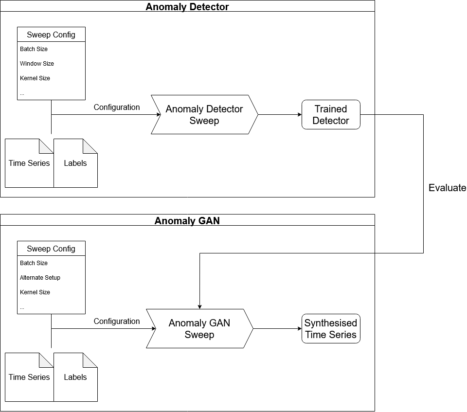

This repository provides the python code used for our research for our **AnomalyGAN**.

We acknowledge support by the state of Baden-Württemberg through bwHPC
and the German Research Foundation (DFG) through grant no INST 40/575-1 FUGG (JUSTUS 2 cluster).

For demo purposes, we provide the code and configurations used to synthesise time series of our CDN data set.
This CDN data set includes artifical anomalies.

## Dependencies
In general, we utilize [Weights and Biases](https://wandb.ai/site) to monitor and orchestrate our experiments. 
Therefore, it is necessary to install WandB locally and create and account to fully use our repository.

Once you have create an account and have the corresponding API-Key this API-Key has to be entered in Docker/wandbkey.json

## Pipeline

The general pipeline for the AnomalyGAN is as follows:

1. Create the Docker Image 
2. Utilize a WandB Sweep to find the best configuration for the AnomalyDetector, which is later used for evaluation purposes.
3. Utilize a WandB Sweep to find the best configuration for the AnomalyGAN, which synthesises time series with specific anomalies.

This repository contains these 3 folders, which are structured according to our pipeline.

1. [Docker](https://omi-gitlab.e-technik.uni-ulm.de/aml/anomalygan/-/tree/demo/Docker) 

2. [Anomaly Detection](https://omi-gitlab.e-technik.uni-ulm.de/aml/anomalygan/-/tree/demo/anomalydetection)

3. [Anomaly GAN](https://omi-gitlab.e-technik.uni-ulm.de/aml/anomalygan/-/tree/demo/anomalyGAN)

Lastly, we also provide Jupyter-Notebooks to explore our code / approach.

4. [Notebooks](https://omi-gitlab.e-technik.uni-ulm.de/aml/anomalygan/-/tree/demo/notebooks)

Please enter the time series with anomalies to the [Data Folder](https://omi-gitlab.e-technik.uni-ulm.de/aml/anomalygan/-/tree/demo/data) in order to utilize our approach.

